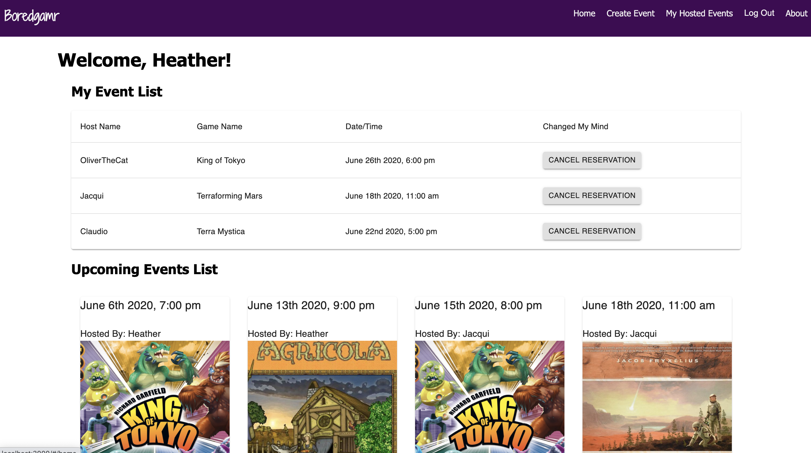

# Boredgamr

## Description

Duration- 2 Week Sprint

Boredgamr was born out of a need I saw amongst my friends and peers. We nerd types love a good board game night but are terrible at planning things. Boredgamr allows users to both host game night events of their own and join others events. This is a great way to get to know other like minded geeks over a wholesome board game and meet new friends. By creating this application, people can stay organized and look forward to upcoming events with new games, new people and new memories. 





This version uses React, Redux, Express, Passport, SendGrid, Material-UI, moment.js, react-datepicker and PostgreSQL (a full list of dependencies can be found in `package.json`).

## Prerequisites

Before you get started, make sure you have the following software installed on your computer:

- [Node.js](https://nodejs.org/en/)
- [PostrgeSQL](https://www.postgresql.org/)
- [Nodemon](https://nodemon.io/)

## Create database and table

Create a new database called `prime_app` and create the tables outlined in the database.sql file.

If you would like to name your database something else, you will need to change `prime_app` to the name of your new database name in `server/modules/pool.js`

## Development Setup Instructions

* Run `npm install`
* `npm install react-datepicker`
* `npm install @sendgrid/mail`
* `npm install @material-ui/core` 
* `npm install moment`

* Create a `.env` file at the root of the project and paste this line into the file:
    ```
    SERVER_SESSION_SECRET=superDuperSecret
    SENDGRID_API_KEY= your sendgrid api key
    SENDGRID_FROM_EMAIL= your email address
    ```
    While you're in your new `.env` file, take the time to replace `superDuperSecret` with some long random string like `25POUbVtx6RKVNWszd9ERB9Bb6` to keep your application secure. Here's a site that can help you: [https://passwordsgenerator.net/](https://passwordsgenerator.net/). If you don't do this step, create a secret with less than eight characters, or leave it as `superDuperSecret`, you will get a warning.

* Start postgres if not running already by using `brew services start postgresql`
* Run `npm run server`
* Run `npm run client`
* Navigate to `localhost:3000`

## Deployment

1. Create a new Heroku project
1. Link the Heroku project to the project GitHub Repo
1. Create an Heroku Postgres database
1. Connect to the Heroku Postgres database from Postico
1. Create the necessary tables
1. Add an environment variable for `SERVER_SESSION_SECRET` with a nice random string for security
1. In the deploy section, select manual deploy

## Author

* Heather Stoffels - heatherstoffels.com

## Thank-you's

* Dane, Dev, and Chris from Prime Digital Academy for your continued support.
* Prime Digital Academy for the opprotunity to learn so much from such talented instructors. 
* Lamport Cohort
